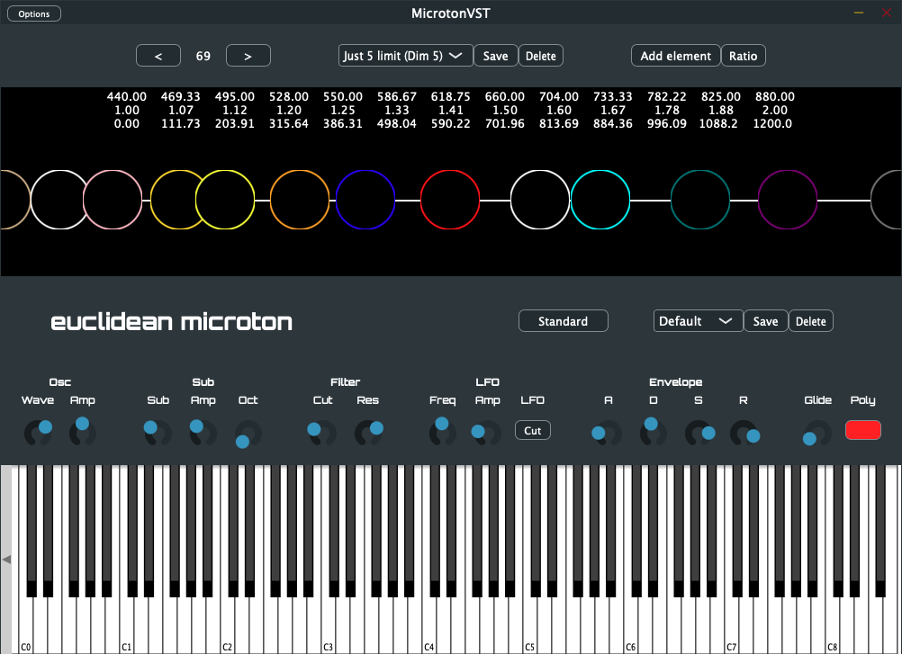

# MicrotonVST for Windows and macOS

All of the sonic potential of the original Microton, now in a convenient VST3 package.

MicrotonVST for Windows and macOS is a port of the groundbreaking microtonal synth, now in a package that aims for maximum portability.

Along with the VST3 plug-in, MicrotonVST includes a standalone application that runs without a DAW host.

At the heart of the Microton is the ‘monochord’: a touch-sensitive visual representation of the instrument’s current tuning as a simple line segment. Selecting a built-in tuning (ranging across antiquity to the 21st century, from cultures around the world) will automatically update the monochord, displaying the unique mathematical relationships of that tuning’s elements. Users can directly interact with the tuning’s elements by moving its icon along the monochord with the touchscreen, or by modifying the element’s properties via the Element Editor. Adding and deleting elements from the tuning is as easy as a button tap. Want to dive deeper? The Element Editor supports mathematical expressions as input, allowing you to precisely sculpt your tuning.

MicrotonVST also features a redesigned sound engine that delivers the same analog-style tone with a significant performance boost, making it a great choice for machines with older CPUs and hardware. 

Get MicrotonVST on our Gumroad store here:

<a class="gumroad-button" href="https://euclideaninstruments.gumroad.com/l/microtonvst">Buy on</a>